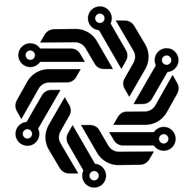

<div align="center">
    
    <h1>lingcage</h1>
    <p><strong>Secure agent infrastructure that cages AI agents with minimum overhead.</strong></p>
</div>

[](https://crates.io/crates/lingcage)
[](https://docs.rs/lingcage)
[](https://github.com/RuoqingHe/lingcage/blob/main/LICENSE)

## Overview

`lingcage` is the sandbox layer on top of [lingcore](https://crates.io/crates/lingcore). It runs a
command in a guest cloned from a template, which is a captured boot of a kernel and a guest image
carrying `lingcage-agent`, and exits with status of the command. Each component is gated behind a
Cargo feature. Two binaries come with the `cli` and `agent` features. API documentation is on
[docs.rs](https://docs.rs/lingcage).

- Templates, sealed and verified spawn sources, captured from a booted guest (`template`).
- Sandboxes, guests cloned from templates in calling process, RAM mapped copy-on-write (`sandbox`).
- Guest agent, `lingcage-agent` in the guest, which host runs commands through over vsock (`agent`).
- Protocol, framing and messages shared by host and guest agent (`lcp`).
- Operator front end, the `lingcage` binary (`cli`).

No feature is on by default, so a program picks the layer it needs: `template` to build and keep
spawn sources, `sandbox` for the guests cloned from them.

## Requirements

- aarch64, x86_64 or riscv64 Linux with KVM enabled, and read/write access to `/dev/kvm`. aarch64
  host needs GICv3, since interrupt controller of a guest is in-kernel distributor and
  redistributors. riscv64 host needs AIA, since controller there is in-kernel APLIC and IMSICs.
- Rust toolchain pinned by
  [rust-toolchain.toml](https://github.com/RuoqingHe/lingcage/blob/main/rust-toolchain.toml) of the
  repository.

## Usage

### Using lingcage

Add `lingcage` to your host program with the `sandbox` feature enabled:

```toml
[dependencies]
lingcage = { version = "0.2", features = ["sandbox"] }
```

Following program starts a sandbox from a registered template, runs a command in it and shuts the
guest down:

```rust
use std::io::Write as _;
use std::time::Duration;

use lingcage::hv::Hv;
use lingcage::sandbox::Sandbox;
use lingcage::sandbox::exec::Command;
use lingcage::sandbox::spec::SandboxSpec;
use lingcage::template::TemplateStore;

fn main() -> Result<(), Box<dyn std::error::Error>> {
    let hv = Hv::open()?;
    let store = TemplateStore::open("/var/lib/lingcage")?;
    let template = store.get(&"base".into())?;
    let spec = SandboxSpec::for_template(&template);
    // A started sandbox runs no command until its agent has connected.
    let sandbox = Sandbox::start(&hv, &template, &spec)?.ready(Duration::from_secs(5))?;

    let mut process = sandbox.exec(Command::new("sh").args(["-c", "read line; echo got $line"]))?;
    // The stream closes with the handle, and the command reads EOF.
    process.stdin.take().expect("a stdin stream").write_all(b"hello\n")?;
    let output = process.wait_with_output()?;
    print!("{}", String::from_utf8_lossy(&output.stdout));

    // The guest is asked to power off, and stopped after five seconds
    // if it has not.
    let exit = sandbox.shutdown(Duration::from_secs(5))?;
    println!("{exit:?}");
    Ok(())
}
```

A template holds the captured boot, so a sandbox from it starts in milliseconds and shares RAM of
the capture copy-on-write. `ready` waits for the agent to connect before the first command, and
`exec` takes several commands one after another on the same guest. `shutdown` asks the guest to
power off, `kill` ends it without asking.

### The lingcage command line

`lingcage` binary is the front end. It is installed with the `cli` feature:

```console
cargo install lingcage --features cli --locked
```

`lingcage check` lists host prerequisites, `template build` boots the guest once and registers the
capture, and `run` clones it, runs the command and exits with status of the command:

```console
$ lingcage check --kernel bzImage
$ lingcage template build --kernel bzImage --initrd initramfs.cpio.gz --memory 256M --vcpus 1 \
      --name base
$ lingcage run --template base -- sh -c 'echo hello from $(hostname)'
```

Store defaults to `/var/lib/lingcage`, use `--store DIR` or `LINGCAGE_STORE` for another one.
`lingcage --help` lists the verbs and their flags.

## License

Apache-2.0, see [LICENSE](https://github.com/RuoqingHe/lingcage/blob/main/LICENSE) in the
repository.
